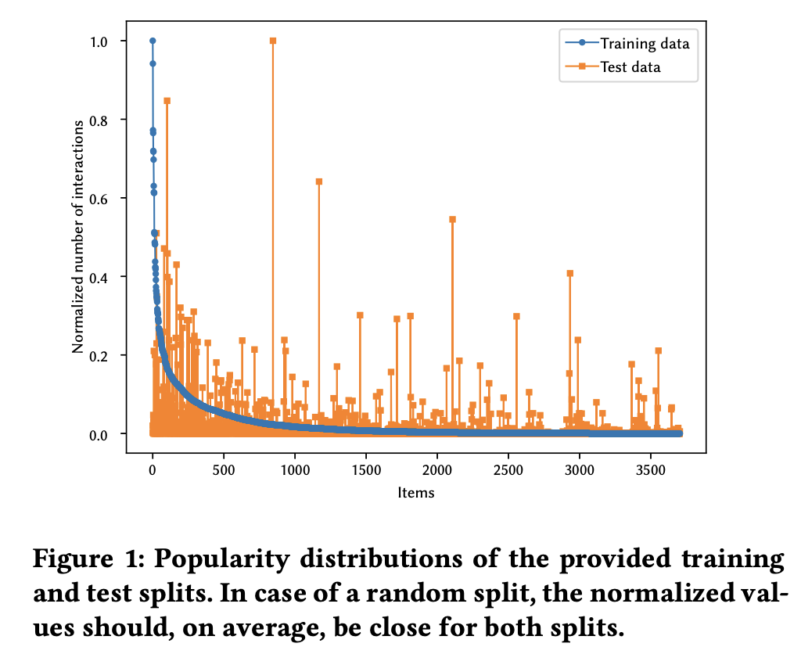
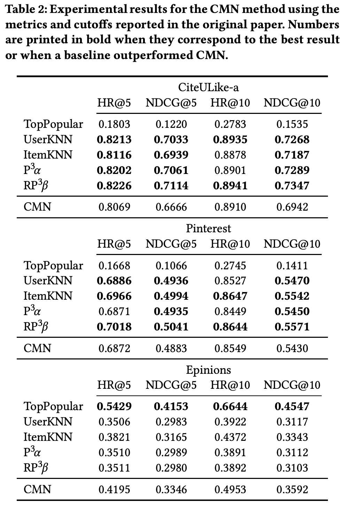
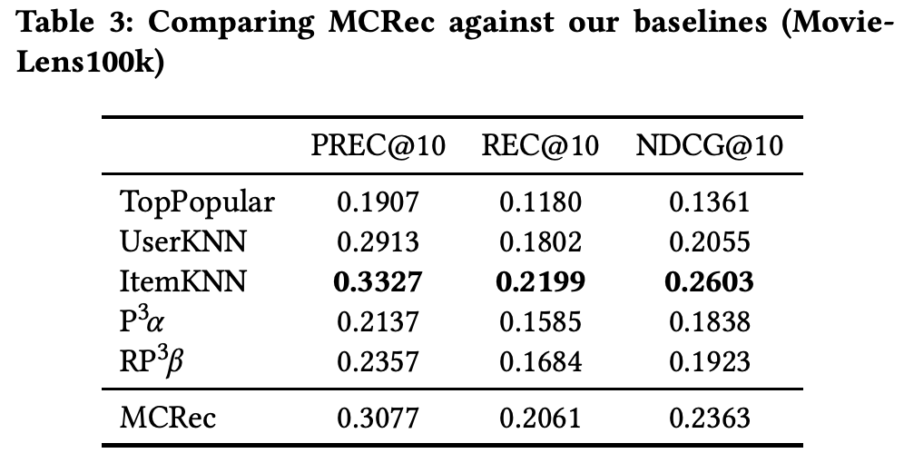
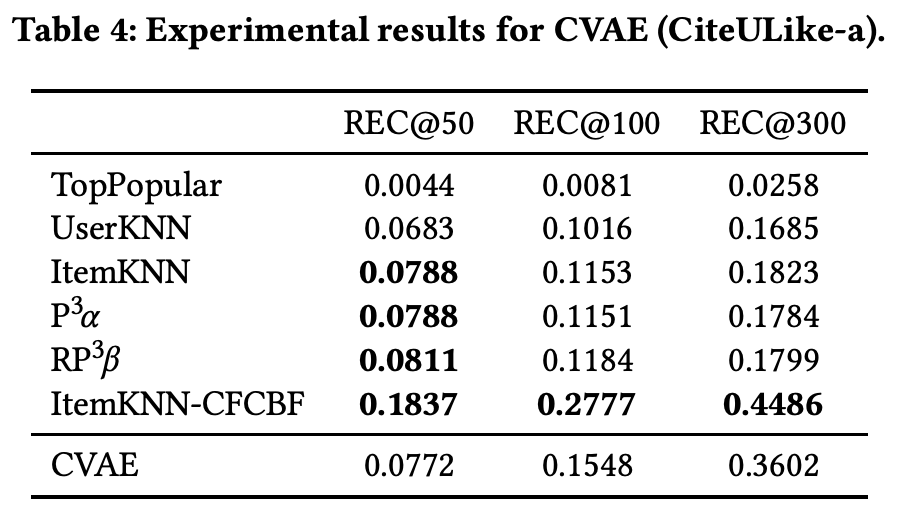
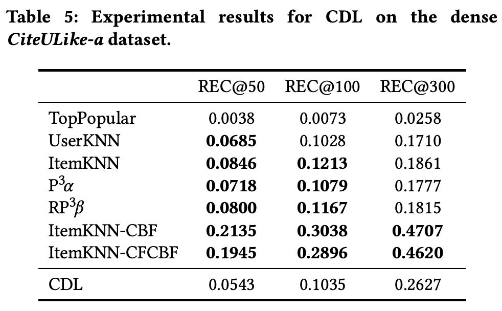
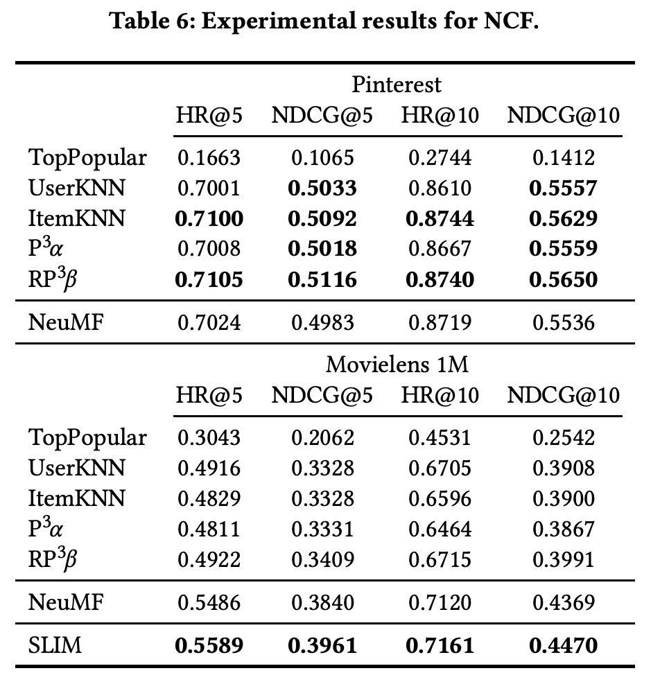
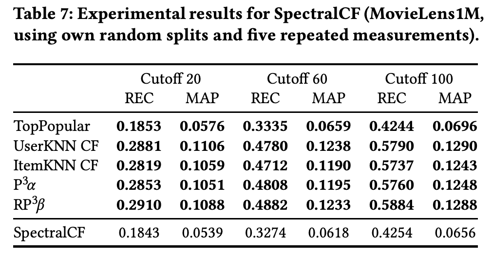
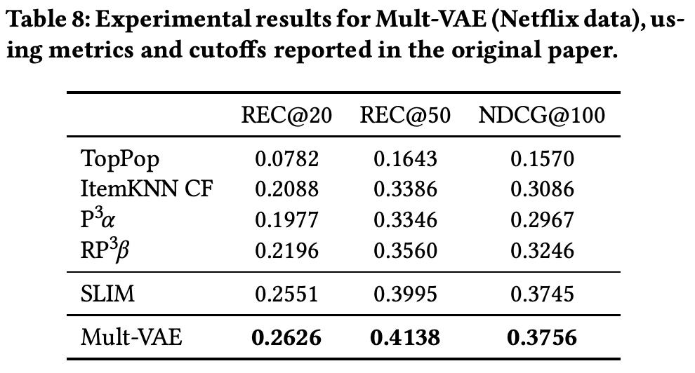
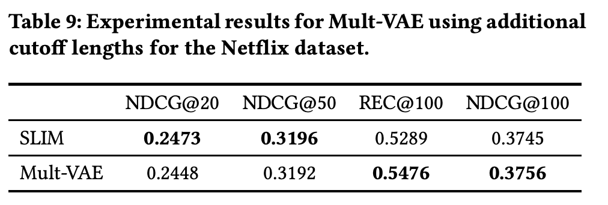

# Are We Really Making Much Progress? A Worrying Analysis of Recent Neural Recommendation Approaches

読み中: 進行中
著者: M. Dacrema
発行年: 2019
学会名: RecSys
キーワード: Deep Learning, Evaluation, Recommend
URL: https://arxiv.org/abs/1907.06902
要約: 「最近のニューラルネット推薦モデル、本当に進歩しているの？」を検証した論文です。
18 本の代表的な研究を再現実験し、従来からあるシンプルな手法（k近傍法やグラフランダムウォークなど）と比べて本当に優れているのかを調べました。結果、多くのニューラル手法は再現が難しく、成績も必ずしも上回らないことが分かりました。

# 概要

- RecSys‘19のBest Paper
- 深層学習を用いたトップn推薦タスクの研究論文を分析
- KDDやRecSys, SIGIR, WWWといった主要会議における18本の代表的な研究を再現実験
- 従来からあるシンプルな手法(KNNやグラフランダムウォーク等)と比べて本当に優れているかを検証
- コード共有がない，データの前処理やパラメータのチューニングなどが記載されておらず11/18が完全に再現できない
- 再現できたアルゴリズムでも、シンプルな手法を一貫して上回らないことを確認

# 背景

- レコメンドシステムにおいて深層学習を用いたアルゴリズムの研究がブームに
- 他の機械学習分野の研究では、新手法がチューニングされた古典的手法と比べ優位が小さいという報告がある
- 深層学習が過大評価される要因
    1. ベースラインを弱く設定
        
        最適化されていない単純な手法や，同系統の深層学習手法のみと比較されるケースが多い
        
        論文の流れが早く最先端のベースラインを設定することが困難になっている
        
    2. 再現性が低い
        
        ソースコードが共有されていない．データの前処理やパラメータのチューニング，性格な評価方法のためのコードの記載がない
        
    3. 評価プロトコルがばらついている
        
        データセット，スプリット方法，指標（HitRate, Recall, NDCG, MAP 等），カットオフ長が論文ごとに異なり，横断的な比較が困難
        
- このような課題に対し，近年の論文を再現実験し，チューニングした古典的手法と比較して本当に性能が良くなっているのかを検証する

# 手法（検証の進め方）

**文献収集**

- 2015‑2018 年の主要会議（KDD, SIGIR, WWW, RecSys）から「深層学習×Top‑N推薦」18 本を抽出。

**再現実験**

- 著者提供コード／データを用い、同じ前処理・評価設定で結果を再現。入手できない場合は著者へ問い合わせ。

**ベースライン手法**

- **TopPopular**
    - 単純な人気順。全ユーザに「一番クリック／視聴が多いアイテム」から推薦
- **ItemKNN**
    - **アイテム同士**の協調フィルタリング。似ているアイテム *k* 件を探し、そのスコアでランキング
- **UserKNN**
    - **ユーザ同士**の協調フィルタリング。似たユーザの履歴を参考にする
- **ItemKNN‑CBF**
    - アイテムの属性（ジャンル、タグなど）だけで類似度を取る**内容ベース**KNN
- **ItemKNN‑CFCBF**
    - 評価行列＋属性ベクトルを連結し、両方から似度を計算する**ハイブリッド**版
- **P3α**
    - ユーザ‑アイテム2部グラフ上を“3ステップ”ランダムウォーク。行き帰り確率を α で調整
- **RP3β**
    - P3α の結果を「人気補正 β」で割り引いてマイナーヒットを上げる

**比較評価**

- 元論文と同じ指標（HitRate, Recall, NDCG, MAP 等）とカットオフで再計測し、ニューラル手法 vs. ベースラインを検証。

# 実験

- CMN(Collaborative Memory Networks, SIGIR’18)
    - データセット
        - CiteULike-a
        - Pinterest
        - Epinions
    - ユーザ近傍に基づくメモリと潜在因子モデルをNNで組み合わせるハイブリットモデル
    - 論文の中では，HRとNDCCについてベースラインを上回ることが報告されている
    - 再現性
        - 提案手法のパラメータは公開されているが，ベースラインのパラメータは公開されていない
    - 結果
        - CIteULike-a, Pinterest
            - 少なくとも二つ以上の最適化された古典的手法に負けている
        - Epinions
            - 古典的手法にはかっているが，非パーソナライズドなTopPopularに負けてる
    - データセットの特殊性や人気バイアスに左右される
    
    
    
- MCRec (Metapath based Context for Recommendation, KDD’18)
    - ユーザやアイテムに関する補助情報の関係（メタパス）を文脈ベクトルとして表し，ユーザ，アイテム，文脈の3者を統合するようにスコアを算出する
    - 論文内ではMovieLens100k, LastFm, YelpをHRやNDGGで評価し，既存手法を超えると報告した
    - 再現性
        - MovieLensのみ詳細が書かれていており再現可能．メタパスはハードコードで提供されており，構築方法等の記載はなかった．
        - NDCCは疑わしい方法で実装されていたため，標準版を利用した
    - 結果
        - ItemKNNを超えることができていない
        - 提供されたコードでは，各メトリックに対し，最良な結果となるようなエポックを選択して報告していることもわかった
    
    
    
- CVAE (Collaborative Variational Autoencoder, KDD’18)
    - VAEを用いて評価データとアイテムの内容情報を統合的に扱う手法
    - 論文内ではCiteULikeの135kと205kで従来手法を凌駕していると報告された
    - 再現性
        - コードとデータセット，評価手順が公開されてい
    - 結果
        - リスト長が50の場合Recallがどの古典的手法よりも下回っている
        - リスト長が最大の300の場合は，ItemKNN-CFCBFを超えることができなかった
    - CVAEは特定の構成においてのみベースラインより有利であり、比較的に長く、むしろ珍しい推奨カットオフ閾値においてのみ有利
    
    
    
- CDL (Collaborative Deep Learning, KDD’15)
    - スタック型デノイジングオートエンコーダ（SDAE）による特徴学習と行列分解に基づく協調フィルタリングを結合させた、階層ベイズモデル
    - CVAEで引用されており，ベースラインとなっている
    - CVAEはCDJに比べてどのリスト長よりも優れていることがわかり．進歩があったことはわかる
    
    
    
- NeuMF (Neural Matrix ****Factorization, WWW’17)
    - 二ューラルネットワークでユーザとアイテムのインタラクション関数を学習する協調フィルタリング手法
    - 論文内ではMovieLens1MとPinterestで評価し，最大10のリスト長でHRとNDCCが既存手法を上回ると報告されている
    - 再現性
        - 評価はLeave-one outでデータ分割も公開されている
        - エポック数は最良となるように選択されていたため，検証セットに基づいて設定するように変更
    - 結果
        - Pinterestでは古典的手法が少なくとも二つ以上NeuMFを上回っている
        - Movielens1MではNeuMFが最も良い性のであったが，単純な線形手法であるSLIMを超えてはいない
    
    
    
- SpectralCF (Spectral Collaborative Filtering, RecSys’18)
    - ユーザ–アイテム二部グラフ上でのスペクトル畳み込みに基づくグラフ協調フィルタリング手法
    - 論文内でMovieLens1M、HetRec、Amazon Instant Videoで評価され，既存手法を凌駕していると報告された
    - 再現性
        - Movielensではコードと共にデータセットも共有されている．他のデータセットは分割の説明はない
        - ハイパラのセットは一つだけ報告されており，それを全てのデータセットで使っていた
    - 結果
        - HetRecとAmazon Instant Videoデータセットでは、TopPoular法も含めたベースラインはすべて、すべての指標でSpectralCFを上回った。
        - MovieLensでは全ての古典的手法がSpectralCFを上回っている
        - 著者が提供したMovieLensのデータ分割で試すとSpectralCFは他の手法を凌駕している
    
    
    
- Mult-VAE (Variational Autoencoders for Collaborative Filtering, WWW’18)
    - 多項分布に基づくVAEを提案し、暗黙的フィードバックの確率的生成モデルとして協調フィルタリングを行う手法
    - 論文内では記事評価や映画評価のデータセットで評価され，最良のベースラインを3％上回ったと報告されている
    - 再現性
        - コードとデータセットが提供されている
        - 論文通りの再現が可能
    - 結果
        - Netflixデータでどの手法よりも良い結果を出している
        - 追加のカットオフ長で検証するとSLIMの方が優れている場合もあった
    
    
    
    
    

# 所感

- 深層学習での研究が盛んに行われているが，その論文の結果に一喜一憂せず，古典的な機械学習など幅広く比較されているか疑いの目を持った方がいいと思った．
- トップカンファを通る論文でも，再現性が確保されていなかったり，評価でちょっと有利になるように報告したりしているのが少し驚き
- 今後このような研究をする際は，公正な評価と再現性の確保も意識してやっていきたい